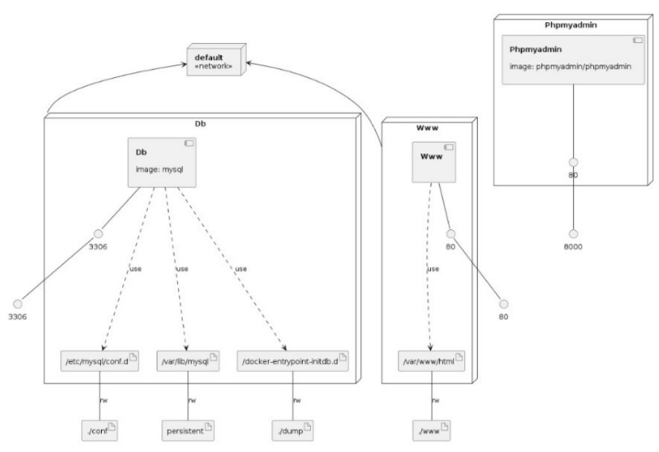

### Portada

Proyecto Final

Presentado por:
-        harold mesa 
-        cristian ballen
-        cristian pardo
-        diana pinzon

Docente:
-        Jaider Ospina

diplomado DevSecOps
### Introducción.

El objetivo de este documento es presentar que se ha diseñado un sistema contenerizado mediante Docker, el cual no solo simplifica el desarrollo y la implementación, sino que también proporciona una plataforma escalable y segura para la gestión de libros y préstamos de los mismos. El sistema abarca funciones, desde la Gestión de Libros hasta la Administración de Usuarios, permite la inserción, actualización, eliminación y visualización de libros, asignación de libros a autores y materias, registro de estudiantes y asociación con préstamos de libros, así como el seguimiento de fechas de préstamo y devolución.
El código fuente se encuentra estructurado de manera clara, utilizando tecnologías como PHP, HTML y MySQL, y contenerizado con Docker para facilitar la gestión del entorno de desarrollo. Se han implementado medidas de seguridad, pruebas unitarias y de rendimiento para garantizar la eficiencia del sistema. Se han proporcionado enlaces a imágenes Docker para una fácil implementación y manuales detallados para los usuarios y desarrolladores. 

# **Especificación de Requerimientos.**

## **Requisitos funcionales y no funcionales**

### **Requerimientos Funcionales.**

#### **Gestión de Libros.**

-   Permitir la inserción, actualización, eliminación y visualización de
    libros.

-   Asignar libros a autores, editoriales y materias.

#### Administración de Estudiantes.

-   Registrar estudiantes.

-   Asociar estudiantes a préstamos de libros.

#### Control de Préstamos.

-   Registrar préstamos de libros a estudiantes.

-   Seguimiento de fechas de préstamo y devolución.

#### Administración de Usuarios.

-   Mantener usuarios con distintos permisos.

-   Permitir la asignación y revocación de permisos.

#### Configuración del Sistema.

-   Almacenar información de configuración como nombre, teléfono,
    dirección, etc.

### Requerimientos No Funcionales.

#### **Seguridad**.

-   Implementar un sistema de autenticación y autorización robusto para
    proteger los datos sensibles.

-   Garantizar la encriptación de las contraseñas almacenadas.

#### **Rendimiento**.

-   Garantizar que el sistema sea eficiente incluso con grandes
    volúmenes de datos.

-   Tiempos de respuesta rápidos para consultas y transacciones.

#### **Escalabilidad**.

-   Diseñar la base de datos y el sistema para escalar sin problemas a
    medida que aumenta la cantidad de usuarios y datos.

#### **Usabilidad**.

-   Interfaz de usuario intuitiva y fácil de usar para minimizar la
    curva de aprendizaje.

#### Disponibilidad.

-   Mantener una alta disponibilidad del sistema para asegurar que esté disponible durante la mayor parte del tiempo posible.

## Casos de uso o historias de usuario.

### Casos de Uso.

-   Gestión de Libros.

    **Nombre**: Registrar nuevo libro.

    **Actor**: Bibliotecario.

    **Descripción**: El bibliotecario puede registrar un nuevo libro en el sistema, ingresando información como título, cantidad, autor, editorial, materia, etc.

-   Administración de Préstamos.

    **Nombre**: Realizar préstamo de libro.

    **Actor**: Bibliotecario.

    **Descripción**: El bibliotecario puede registrar un préstamo de libro para un estudiante, seleccionando el libro deseado, la fecha de préstamo y devolución, y asociándolo al estudiante.

-   Control de Usuarios.

    **Nombre**: Asignar permisos a usuarios.

    **Actor**: Administrador

    **Descripción**: El administrador puede asignar o modificar los permisos de acceso a distintos módulos del sistema para cada usuario, como acceso a la gestión de libros,     estudiantes, configuración, etc.

### Historias de Usuario.

-   Como usuario, quiero poder buscar libros por título para encontrar
    rápidamente el libro que necesito.

-   Como bibliotecario, quiero poder ver la lista de préstamos actuales
    para administrar mejor los recursos de la biblioteca.

-   Como administrador, quiero poder cambiar la configuración del
    sistema, como la información de contacto de la biblioteca, para
    mantenerla actualizada.

-   Como estudiante, quiero poder ver mi historial de préstamos y fechas
    de devolución para recordar cuándo debo devolver los libros.

# Diseño del Sistema.

Para diseñar un sistema de préstamos de una biblioteca se identifican los siguientes componentes e interacción entre módulos.

### Componentes del Sistema:

1. **Módulo de Usuarios:**
   - Gestiona la autenticación y el control de acceso.
   - Permite la creación, edición y eliminación de usuarios.
   - Asigna roles y permisos a los usuarios para controlar su acceso.

2. **Módulo de Libros:**
   - Administra la información sobre los libros disponibles en la biblioteca.
   - Permite la adición, edición y eliminación de libros.
   - Asocia libros con autores, editoriales y materias.

3. **Módulo de Préstamos:**
   - Gestiona los préstamos de libros a estudiantes.
   - Registra la información de préstamo, incluyendo fechas de préstamo y devolución.
   - Controla el inventario de libros disponibles para préstamo.

4. **Módulo de Configuración:**
   - Permite la configuración del sistema, incluyendo información como nombre, teléfono, dirección, correo, etc.

### Interacción entre Componentes:

- Los usuarios autenticados tienen acceso a las funcionalidades según sus roles y permisos.
- Los usuarios pueden buscar y ver información sobre los libros disponibles, autores, editoriales, etc.
- Los usuarios autorizados pueden realizar préstamos de libros a estudiantes.
- El sistema verifica la disponibilidad del libro para préstamo y registra la transacción.
- Los estudiantes pueden acceder a sus préstamos activos, ver fechas de devolución, etc.
- La configuración del sistema está disponible para administradores para mantener datos generales.

### Flujo de Trabajo:

1. **Gestión de Usuarios:**
   - Crear/Editar/Eliminar usuarios y asignar roles y permisos.

2. **Gestión de Libros:**
   - Administrar la información de libros, autores y editoriales.

3. **Proceso de Préstamo:**
   - Usuario busca un libro disponible.
   - Se verifica la disponibilidad del libro.
   - Se registra el préstamo asociado al estudiante.

4. **Configuración del Sistema:**
   - Mantener los datos generales y de contacto de la biblioteca.

Este diseño proporciona una visión general de cómo los diferentes módulos interactúan entre sí en un sistema de préstamos de biblioteca. Cada módulo puede tener su propia interfaz de usuario y funcionalidades específicas para administrar datos y permitir la interacción con los usuarios finales. La implementación técnica de estos componentes dependerá del entorno y tecnologías específicas utilizadas en el desarrollo del sistema.

# Documentación del Código.

#### 1. Tecnologías Utilizadas:
El proyecto utiliza PHP como lenguaje de programación para la lógica del servidor, HTML para la interfaz de usuario, y MySQL a través de PhpMyAdmin para la gestión de la base de datos. Se encuentra contenerizado con Docker para la gestión del entorno de desarrollo.

#### 2. Explicación:
La aplicación está estructurada con PHP manejando la lógica del servidor y la comunicación con la base de datos MySQL a través de PhpMyAdmin. La interfaz de usuario está desarrollada en HTML. Docker se utiliza para gestionar el entorno y la portabilidad del proyecto.

### 3. Descripción del Código Fuente:
#### Estructura del Proyecto:

- `/PrestamosGdocumental`: Carpeta principal que contiene el código fuente.
- `/PrestamosGdocumental/Assets`: Estilos CSS y Fuentes de la Aplicación.
- `/PrestamosGdocumental/Libraries`: Libreria de Generación de PDF.
- `/PrestamosGdocumental/Controllers`: Controladores PHP para la lógica del sistema.
- `/PrestamosGdocumental/Views`: Archivos HTML para la interfaz de usuario.
- `/PrestamosGdocumental/Models`: Modelos PHP para la interacción con la base de datos.

#### Funcionalidades Principales:
- **Buscar Libros:** Permite a los usuarios buscar libros por título, autor, etc.
- **Administrar Préstamos:** Gestiona préstamos, devoluciones y fechas límite.
- **Agregar/Editar Información:** Permite la adición y edición de información de libros, autores y estudiantes.

### 4. Tecnologías Utilizadas:
#### Descripción Detallada:
- **PHP:** Maneja la lógica del servidor y las interacciones con la base de datos.
- **HTML:** Define la estructura y la interfaz de usuario.
- **MySQL (PhpMyAdmin):** Almacena y gestiona la información del sistema.
- **Docker:** Utilizado para contenerizar la aplicación y gestionar el entorno de desarrollo.

### 5. Instrucciones de Ejecución:
#### Pasos para Desplegar el Proyecto:
1. Clonar el repositorio desde GitHub.
2. Instalar Docker y Docker Compose en el sistema.
3. Ejecutar el siguiente comando:
`docker-compose up -d`
5. Si es necesario, modificar y configurar el entorno y las variables necesarias en [Dockerfile](Dockerfile) y [docker-compose.yml ](docker-compose.yml )

### 6. Consideraciones de Seguridad:
#### Medidas Implementadas:
- Encriptación de contraseñas en la base de datos.
- Validación de entrada para evitar inyecciones SQL.
- Control de acceso basado en roles para proteger datos sensibles.

### 9. Pruebas Realizadas:
#### Resultados:
- Pruebas unitarias para cada módulo y función.
- Pruebas de integración para verificar la interacción entre componentes.
- Pruebas de rendimiento para evaluar la velocidad y la escalabilidad.

### 10. Mantenimiento y Futuras Mejoras:
#### Mejoras Propuestas:
- Implementación de una interfaz más intuitiva y amigable.
- Optimización del rendimiento de la base de datos.
- Mejoras en la seguridad y la escalabilidad del sistema.

# Enlaces Docker.

phpmyadmin:

https://hub.docker.com/repository/docker/cpardoan/phpmyadmin_prestamos

mysql:

https://hub.docker.com/repository/docker/cpardoan/mysql_prestamos

Codigo:

https://hub.docker.com/repository/docker/cpardoan/prestamos

# Manuales.
- [Manual de Usuario](Manual_Usuario.pdf) :Documento que proporciona información detallada sobre cómo utilizar el sistema de préstamos de biblioteca.

# Diagramas y Gráficos.

1. **Modelo Entidad Relación**

2. **Flujo de Proceso**

3. **Modelo infraestructura**

